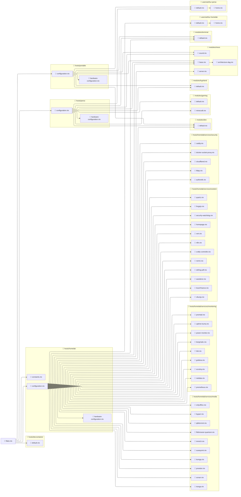

# ❄️ NixOS Inter-File Dependency Graph

```mermaid
%%{init: {"flowchart": {"defaultRenderer": "elk"}} }%%
graph LR

  N0["📄 flake.nix"]
  subgraph "📂 hosts/devcontainer"
    direction LR
    N1["📄 default.nix"]
  end

  subgraph "📂 hosts/homelab"
    direction LR
    N2["📄 configuration.nix"]
    N3["📄 constants.nix"]
    N4["📄 hardware-configuration.nix"]
  end

  subgraph "📂 hosts/homelab/services/media"
    direction LR
    N5["📄 byparr.nix"]
    N6["📄 filebrowser-quantum.nix"]
    N7["📄 immich.nix"]
    N8["📄 komga.nix"]
    N9["📄 onlyoffice.nix"]
    N10["📄 prowlarr.nix"]
    N11["📄 qbittorrent.nix"]
    N12["📄 sonarr.nix"]
    N13["📄 suwayomi.nix"]
    N14["📄 tranga.nix"]
  end

  subgraph "📂 hosts/homelab/services/monitoring"
    direction LR
    N15["📄 borgmatic.nix"]
    N16["📄 grafana.nix"]
    N17["📄 loki.nix"]
    N18["📄 netdata.nix"]
    N19["📄 power-monitor.nix"]
    N20["📄 prometheus.nix"]
    N21["📄 promtail.nix"]
    N22["📄 scrutiny.nix"]
    N23["📄 uptime-kuma.nix"]
  end

  subgraph "📂 hosts/homelab/services/random"
    direction LR
    N24["📄 crafty-controller.nix"]
    N25["📄 forgejo.nix"]
    N26["📄 homepage.nix"]
    N27["📄 local-finance.nix"]
    N28["📄 n8n.nix"]
    N29["📄 quartz.nix"]
    N30["📄 romm.nix"]
    N31["📄 security-watchdog.nix"]
    N32["📄 stirling-pdf.nix"]
    N33["📄 vert.nix"]
    N34["📄 vikunja.nix"]
    N35["📄 wanderer.nix"]
  end

  subgraph "📂 hosts/homelab/services/security"
    direction LR
    N36["📄 authentik.nix"]
    N37["📄 caddy.nix"]
    N38["📄 cloudflared.nix"]
    N39["📄 docker-socket-proxy.nix"]
    N40["📄 lldap.nix"]
  end

  subgraph "📂 hosts/perso"
    direction LR
    N41["📄 configuration.nix"]
    N42["📄 hardware-configuration.nix"]
  end

  subgraph "📂 hosts/portable"
    direction LR
    N43["📄 configuration.nix"]
    N44["📄 hardware-configuration.nix"]
  end

  subgraph "📂 modules/dev"
    direction LR
    N45["📄 default.nix"]
  end

  subgraph "📂 modules/gaming"
    direction LR
    N46["📄 default.nix"]
    N47["📄 minecraft.nix"]
  end

  subgraph "📂 modules/hyprland"
    direction LR
    N48["📄 default.nix"]
  end

  subgraph "📂 modules/nixos"
    direction LR
    N49["📄 architecture-dag.nix"]
    N50["📄 base.nix"]
    N51["📄 server.nix"]
    N52["📄 sound.nix"]
  end

  subgraph "📂 modules/terminal"
    direction LR
    N53["📄 default.nix"]
  end

  subgraph "📂 users/arthur-homelab"
    direction LR
    N54["📄 default.nix"]
    N55["📄 home.nix"]
  end

  subgraph "📂 users/arthur-perso"
    direction LR
    N56["📄 default.nix"]
    N57["📄 home.nix"]
  end

  N0 --> N1
  N0 --> N2
  N0 --> N3
  N0 --> N41
  N0 --> N43
  N2 --> N4
  N2 --> N5
  N2 --> N6
  N2 --> N7
  N2 --> N8
  N2 --> N9
  N2 --> N10
  N2 --> N11
  N2 --> N12
  N2 --> N13
  N2 --> N14
  N2 --> N15
  N2 --> N16
  N2 --> N17
  N2 --> N18
  N2 --> N19
  N2 --> N20
  N2 --> N21
  N2 --> N22
  N2 --> N23
  N2 --> N24
  N2 --> N25
  N2 --> N26
  N2 --> N27
  N2 --> N28
  N2 --> N29
  N2 --> N30
  N2 --> N31
  N2 --> N32
  N2 --> N33
  N2 --> N34
  N2 --> N35
  N2 --> N36
  N2 --> N37
  N2 --> N38
  N2 --> N39
  N2 --> N40
  N2 --> N45
  N2 --> N50
  N2 --> N51
  N2 --> N53
  N2 --> N54
  N41 --> N42
  N41 --> N45
  N41 --> N46
  N41 --> N47
  N41 --> N48
  N41 --> N50
  N41 --> N52
  N41 --> N53
  N41 --> N56
  N43 --> N44
  N43 --> N45
  N43 --> N48
  N43 --> N50
  N43 --> N52
  N43 --> N53
  N43 --> N56
  N50 --> N49
  N54 --> N55
  N56 --> N57
```
