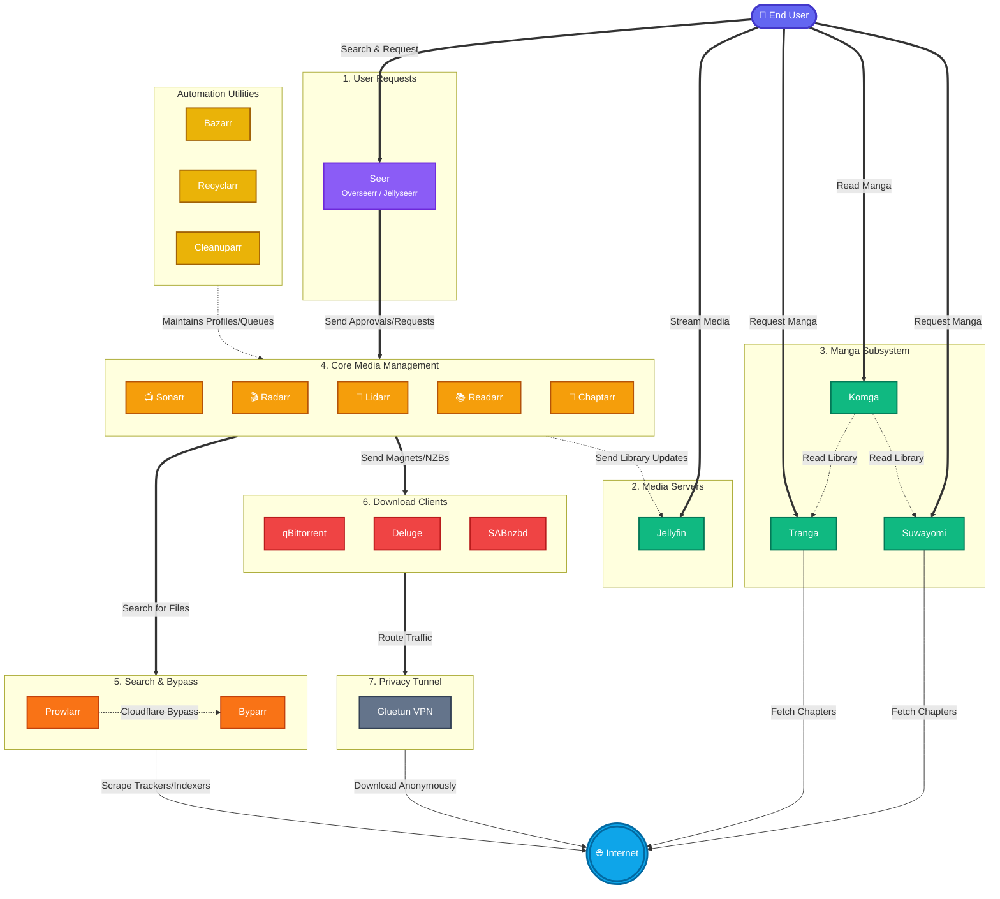

**1. User Requests (The Front-End)**
* **Overseerr**: A web interface that allows you, your friends, or your family to browse for movies and TV shows and click a button to request them.
* **Jellyseerr**: A modified version of Overseerr specifically built to integrate directly with Jellyfin and Emby media servers.
* **Seer**: A mored interface that merge Overseerr and Jellyseerr.

**2. Core Media Management (The "Arrs")**
* **Sonarr**: The brain for TV shows. It monitors upcoming episodes, grabs them when they release, and renames/organizes the files.
* **Radarr**: The brain for Movies. It monitors for releases in your desired quality (like 4K or 1080p) and organizes them.
* **Lidarr**: The brain for Music. It tracks artists, albums, and singles, organizing audio files and fetching album art.
* **Readarr**: The brain for written media. It tracks and organizes e-books and audiobooks.
* **Chaptarr**: A newer, highly anticipated fork/replacement for Readarr, built to modernize how self-hosted servers handle audiobooks and e-books.

**3. Search and Bypass**
* **Prowlarr**: A central search hub. Instead of setting up torrent sites in every single Arr app, you put them in Prowlarr once, and it syncs them to all the Arrs automatically.
* **Byparr**: A background proxy tool. When Prowlarr tries to search a website but gets blocked by a Cloudflare captcha or anti-bot screen, Byparr solves the check and lets the search continue.

**4. Download Clients**
* **qBittorrent**: A highly popular, fast, open-source application for downloading torrents.
* **Deluge**: Another lightweight open-source torrent downloader, favored by some for its ability to handle massive amounts of torrents simultaneously.
* **SABnzbd**: A downloader specifically for Usenet (an alternative to torrenting that uses decentralized newsgroup servers to download files at max internet speeds).

**5. Privacy Tunnel**
* **Gluetun**: A lightweight VPN client running in a container. You route your download clients (like qBittorrent) through Gluetun so your real IP address is hidden from your Internet Service Provider.

**6. Automation Utilities**
* **Bazarr**: A companion application that scans your downloaded movies and TV shows and automatically downloads matching subtitles in your preferred languages.
* **Recyclarr**: A command-line tool that automatically updates Sonarr and Radarr with the best community-tested quality profiles, ensuring you do not download bloated or poorly encoded files.
* **Cleanuparr**: A digital janitor. If a download gets stuck at 99%, or if a torrent turns out to be fake, Cleanuparr deletes the bad file and tells Sonarr/Radarr to try downloading a different one.

**7. Manga and Comics**
* **Tranga**: An automated tracker and downloader built specifically for manga. It monitors scanlation websites and downloads new chapters as soon as they are translated.
* **Komga**: A specialized media server designed entirely for reading comic books and manga. It organizes your downloaded archives into readable galleries.
* **Suwayomi**: A self-hosted server based on the popular Tachiyomi app. It allows you to download, sync, and read manga across all your mobile devices and browsers.

**8. Media Presentation**
* **Jellyfin**: The main media server. It acts like your own personal Netflix, taking all the raw video and audio files from your hard drive and streaming them cleanly to your TV, phone, or computer.

